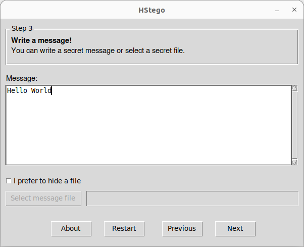
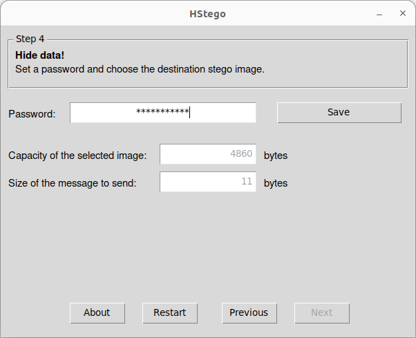

## What is HStego?


**HStego** is a tool for hiding data in bitmap and JPEG images.
This tool uses some of the most advanced steganography methods known today, along with an upper limit on the amount of data that can be hidden so that it cannot be reliably detected by modern steganography tools.


> **WARNING:** This tool is in a ALPHA stage. Use at your own risk. <br>
> If you find any problem, please open an [issue](https://github.com/daniellerch/hstego/issues).


## Documentation:
- [Download](#download)
- [GUI examples](#gui-examples)
- [Command line examples](#command-line-examples)
- [Install from source code](#install)
- [Python examples](#python-examples)
- [Technical details](#technical-details)
- [Acknowledgments](#acknowledgments)
<br>


## Download

HStego is available as a standalone binary for Linux and for Windows. These 
binaries have a [graphical user interface](#gui-examples), although they can 
be used using the 
[command line](#command-line-examples).

Download Links:
- [Linux x86\_64 v0.5](https://github.com/daniellerch/hstego/releases/download/v0.5/hstego-0.5-linux.x86_64) 
- [Windows AMD64 v0.5](https://github.com/daniellerch/hstego/releases/download/v0.5/hstego-0.5-win.amd64.exe)


## GUI examples:

The interface is quite intuitive. During hiding HStego prompts for the image, 
the message to hide, a password, and the resulting stego image. The procedure 
can be seen in the following images.

<p float="left">
   
   
   
   
</p>

During extraction the procedure is similar. HStego asks for the stego image 
and for the password.

<p float="left">
   
   
   
</p>


## Command line examples:

HStego can be used from the command line. Here are some examples of how to use it.


Example using bitmap images:

```bash
hstego.py embed secret.txt cover.png stego.png MyP4ssw0rd101
```

```bash
hstego.py extract stego.png content.txt MyP4ssw0rd101
```


Example using JPEG images:

```bash
hstego.py embed secret.txt cover.jpg stego.jpg MyP4ssw0rd101
```

```bash
hstego.py extract stego.jpg content.txt MyP4ssw0rd101
```


## Install from source code

You can install HStego with the following commands:
```bash 
sudo pip3 install imageio numpy scipy pycryptodome numba Pillow
sudo pip3 install git+https://github.com/daniellerch/hstego.git@v0.4
```

Uninstall with:
```bash 
sudo pip3 uninstall hstego
```

Your operating system may need to install some libraries. In case of Debian based systems you can use the following commands:

```base
sudo apt-get install build-essential python-dev libjpeg-dev python3-tk
```


## Python examples

HStego can also be used as a Python library. Check out the following examples:

Example using bitmap images:

```python
import hstegolib
hill = hstegolib.S_UNIWARD()

# Hide a message
hill.embed("cover.png", "secret.txt", "MyP4ssw0rd101", "stego.png")

# Extract the message
hill.extract("stego.png", "MyP4ssw0rd101", "content.txt")
```


Example using JPEG images:

```python
import hstegolib
juniw = hstegolib.J_UNIWARD()

# Hide a message
juniw.embed("cover.jpg", "secret.txt", "MyP4ssw0rd101", "stego.jpg")

# Extract the message
juniw.extract("stego.png", "MyP4ssw0rd101", "content.txt")
```


## Technical details:

HStego can hide information in bitmap and JPEG images. HStego gets the best 
place for hiding the data in bitmap images using the [S-UNIWARD](#acknowledgments) 
cost function, and for hiding data into JPEG images using the function 
[J-UNIWARD](#acknowledgments) + [Cost Polarization](#acknowledgments). The final embedding is done using 
[Syndrome Trellis Codes](#acknowledgments). 

Even using this advanced methods, powerful steganalysis tools based on 
deep learning could detect the hidden information if we hide too much data.
Therefore, HStego limits the maximum amount of information to 5% of the total 
capacity. This 5% has been calculated using the 
[Aletheia](https://github.com/daniellerch/aletheia) steganalysis tool and 
this is the maximum that can be hidden without being reliably detected, under
adverse conditions.


## Acknowledgments:

HStego implements the J-UNIWARD with cost polarization for JPEG images and the 
S-UNIWARD method for bitmap images. 

NOTE: In versions prior to 0.4, HStego used the HILL cost function for the 
spatial domain and the J-UNIWARD method for JPEG images.


These methods are described in the following papers:


- [Universal Distortion Function for Steganography in an Arbitrary Domain](https://doi.org/10.1186/1687-417X-2014-1) by Vojtěch Holub, Jessica Fridrich and Tomáš Denemark

- [JPEG Steganography With Estimated Side-Information](https://ieeexplore.ieee.org/document/8746719) by Weixiang Li, Kejiang Chen, Weiming Zhang, Hang Zhou, Yaofei Wang and Nenghai Yu.

- [A New Cost Function for Spatial Image Steganography](https://doi.org/10.1109/ICIP.2014.7025854) by Bin Li, Ming Wang, Jiwu Huang and Xiaolong Li.


The embedding is implemeted using Syndrome Trellis Codes:

- [Minimizing Embedding Impact in Steganography using Trellis-Coded Quantization](https://doi.org/10.1117/12.838002) by Tomas Filler, Jan Judas and Jessica Fridrich.

- [Minimizing Additive Distortion Functions With Non-Binary Embedding Operation in Steganography](https://doi.org/10.1109/WIFS.2010.5711444) by Tomas Filler and Jessica Fridrich.

- [Minimizing Additive Distortion in Steganography using Syndrome-Trellis Codes](https://doi.org/10.1109/TIFS.2011.2134094) by Tomas Filler, Jan Judas and Jessica Fridrich.


Part of the C/C++ code used by HStego comes from the [Digital Data Embedding Laboratory](http://dde.binghamton.edu/download/).

This software would not have been possible without their excellent work.


